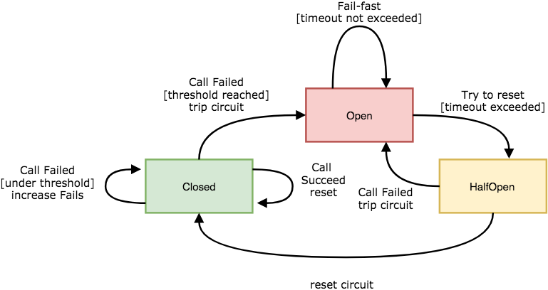

# Circuit breaker for typescript

This project is a lightweight and easy-to-use circuit breaker, designed for typescript and functional programming.

It has two different purposes:
- A production ready circuit breaker for typescript
- A tutorial to understand this useful resilience pattern through typescript

## Getting Started

### Why to use it

If this resilience pattern does not sounds familiar to you, take a look on these resources:
- [Circuit breaker wikipedia](https://en.wikipedia.org/wiki/Circuit_breaker_design_pattern)
- [Circuit breaker - Martin Fowler](https://martinfowler.com/bliki/CircuitBreaker.html)
- [Release It!](https://pragprog.com/book/mnee2/release-it-second-edition)

### Install

```bash
npm i circuit-breaker-typescript
```

### How to Use It

#### Promises
Let's assume you have an http call and you want to fail-fast gracefully without waiting for TCP connection timeout in
 case of the service eventually is not available:
```typescript
const unprotectedPromise = () => fetch(someUrl).then(response => response.json());
```

Protecting it is pretty straight forward:
```typescript

const circuitBreaker = new CircuitBreaker();

const protectedPromise = circuitBreaker.protectPromise(unprotectedPromise);

//normal use
protectedPromise().then(...);
```

#### Functions
You have a function that you want to protect:
```typescript
const unprotectedFunction = (params: Params) => { 
    // side effects that can eventually fail recurrently 
    };
```

Protecting it:
```typescript

const circuitBreaker = new CircuitBreaker();

const protectedFunction = circuitBreaker.protectFunction(unprotectedFunction);

//normal use
protectedFunction(params)
```

### Custom params

#### CircuitBreaker(config: CircuitBreakerConfig)

Create a new instance of a circuit breaker. It accepts the following config options:

##### CircuitBreakerConfig: maxFailures

Number of errors after the circuit trips to open and starts short-circuiting requests and failing-fast.

*Default Value:* 5

##### CircuitBreakerConfig: resetTimeoutInMillis

Time in milliseconds in which after tripping to open the circuit will remain failing fast.

*Default Value:* 1000

```typescript

const circuitBreaker = new CircuitBreaker({maxFailures: 10, resetTimeoutInMillis: 10000});
````

### Failing-fast

Circuit breaker will fail fast when any call enters to it during the open period, in these cases it will throw or return
an error `Error('CircuitBreaker: fail-fast')`

## Local development

### Prerequisites

Please install `npm` or `yarn`.

### Install 

`yarn install`

### Running the tests

Tests are configured to fail if coverage go below 90%, you can see the report just running the tests:

`yarn test`

## Motivation and project break down

The motivation of this project was to understand this resilience pattern and provide a ready-for-production 
implementation in a some programming language. 

These are some of the aspects that have been used or taken in account to design the solution:

- Language: **typescript**
- Functional programming in mind (Immutability, lambdas ...)
- Finite state machines
 
 
### Circuit breakers

The main purpose of circuit breakers in software world is to provide the capability to detect failures in your system
 in order to handle the errors quickly and gracefully without waiting for problems. Another good aspect 
 about them is that they prevent to cascade problems to another components/systems because they act as a walls when 
 they are open.
 
### Circuit breaker state diagram

<p align="center">
  
</p>

- **Circuit Closed**: 
    - Failures increase the failures counter
    - Call Successes reset the failures to zero
    - When the failures counter reaches the maxFailures threshold, the breaker trips to **Open**
    
- **Circuit Open**: 
    - The circuit breaker fail fast always, calls are not made
    - After the timeout expires the circuit enters to **HalfOpen**
    
- **Circuit HalfOpen**: 
    - The first call that enters to the circuit in this state will be allowed:
        - If the call succeeds, the breaker is reset back to **Closed**
        - If the call fails, the breaker is trip back into **Open**

### Circuit breaker finite state machine

A finite state machine is a computational model that can be in exactly one of a finite number of states at 
any given time. The state machine can change from one state to another in response to some external inputs and the 
change from one state to another is called a transition. 

Having in mind the definition, let's define the state machine:
 
- The state machine for circuit breaker will transition between the three different states, Closed, Open and HalfOpen.
- The state machine will receive the inputs of the app as **events**: 
    - `CallSucceed`: If the call succeed this event will be sent to the state machine
    - `CallFailed`: If the call failed this event will be sent to the state machine
    - `BeforeCall`: In order to detect if the reset timeout has expired when the circuit is `Open` we need either 
    sent a signal or keep a timer, with the first option the system won't need to check periodically, it will react 
    when a call is going to be made.

### State transition table

| Current State    | Event            | Condition            | Next State      |      
| ---------------- | ---------------- | -------------------- | ----------------| 
| Closed           | `CallSucceed`    | -                    | Closed          |
| Closed           | `CallFailed`     | under threshold      | Closed          |
| Closed           | `CallFailed`     | max failures reached | Open            |
| Closed           | `BeforeCall`     | -                    | Closed          |
| Open             | `CallSucceed`    | -                    | Open            |
| Open             | `CallFailed`     | -                    | Open            |
| Open             | `BeforeCall`     | timeout not exceeded | Open            |
| Open             | `BeforeCall`     | timeout exceeded     | HalfOpen        |
| HalfClosed       | `CallSucceed`    | -                    | Closed          |
| HalfClosed       | `CallFailed`     | -                    | Open            |
| HalfClosed       | `BeforeCall`     | -                    | HalfOpen        |

### Component diagram

<p align="center">
  
</p>

- [States](src/state-machine/states.ts): The states in which the circuit can be `Closed`, `Open` or 
`HalfOpen`.
- [State machine](src/state-machine/state-machine.ts): The *immutable* finite state machine that controls the 
transitions between the different states in response to some external inputs.
- [Circuit breaker](src/circuit-breaker.ts): Main class of the application, it is the public api, controls the general 
flow and keeps the state machine.

### Flows

#### Happy path flow 
<p align="center">
  
</p>


## TODO

- Add support for metrics/notify
- Add support for fallbacks 


