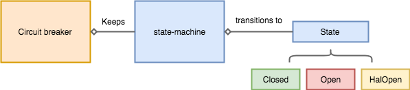
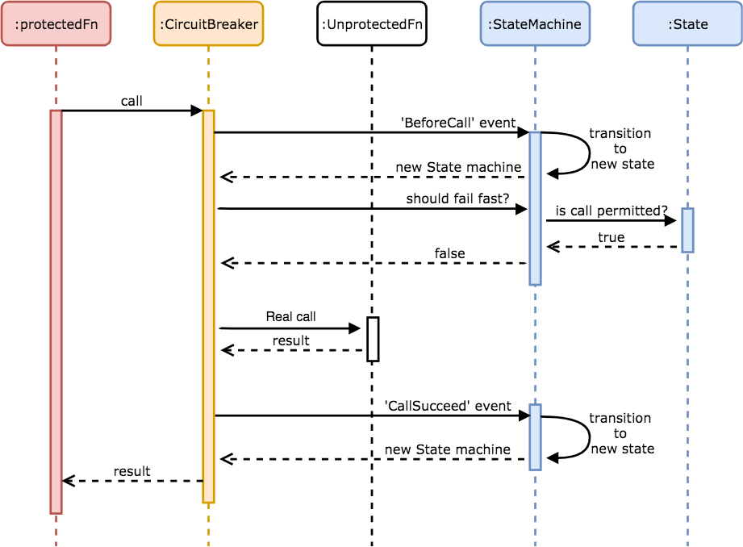

# Circuit breaker for typescript

This project is a lightweight and easy-to-use circuit breaker, designed for typescript and functional programming.

It has two different purposes:
- A production ready circuit breaker for typescript
- A tutorial to understand this useful resilience pattern through typescript

## Getting Started

### Why to use it

If this resilience pattern does not sounds familiar to you, take a look on these resources:
- [Circuit breaker wikipedia](https://en.wikipedia.org/wiki/Circuit_breaker_design_pattern)
- [Circuit breaker - Martin Fowler](https://martinfowler.com/bliki/CircuitBreaker.html)
- [Release It!](https://pragprog.com/book/mnee2/release-it-second-edition)

### Install

```bash
npm i circuit-breaker-typescript
```

### How to Use It

#### Promises
Let's assume you have an http call and you want to fail-fast gracefully without waiting for TCP connection timeout in
 case of the service eventually is not available:
```typescript
const unprotectedPromise = () => fetch(someUrl).then(response => response.json());
```

Protecting it is pretty straight forward:
```typescript

const circuitBreaker = new CircuitBreaker();

const protectedPromise = circuitBreaker.protectPromise(unprotectedPromise);

//normal use
protectedPromise().then(...);
```

#### Functions
You have a function that you want to protect:
```typescript
const unprotectedFunction = (params: Params) => { 
    // side effects that can eventually fail recurrently 
    };
```

Protecting it:
```typescript

const circuitBreaker = new CircuitBreaker();

const protectedFunction = circuitBreaker.protectFunction(unprotectedFunction);

//normal use
protectedFunction(params)
```

### Custom params

#### CircuitBreaker(config: CircuitBreakerConfig)

Create a new instance of a circuit breaker. It accepts the following config options:

##### CircuitBreakerConfig: maxFailures

Number of errors after the circuit trips to open and starts short-circuiting requests and failing-fast.

*Default Value:* 5

##### CircuitBreakerConfig: resetTimeoutInMillis

Time in milliseconds in which after tripping to open the circuit will remain failing fast.

*Default Value:* 1000

```typescript

const circuitBreaker = new CircuitBreaker({maxFailures: 10, resetTimeoutInMillis: 10000});
````

### Failing-fast

Circuit breaker will fail fast when any call enters to it during the open period, in these cases it will throw or return
an error `Error('CircuitBreaker: fail-fast')`

## Local development

### Prerequisites

Please install `npm` or `yarn`.

### Install 

`yarn install`

### Running the tests

`yarn test`

## Motivation and project break down

### Circuit breaker diagram

<p align="center">
  
</p>

- [States](src/state-machine/states.ts): The states in which the circuit can be `Closed`, `Open` or 
`HalfOpen`.
- [State machine](src/state-machine/state-machine.ts): The *immutable* finite state machine that controls the 
transitions between the different states in response to some external inputs. It will be in exactly one of a finite 
number of states at any given time. 
- [Circuit breaker](src/circuit-breaker.ts): Main class of the application, it is the public api, controls the general 
flow and keeps the state machine.

### Circuit breaker flow

#### Happy path flow 
<p align="center">
  
</p>


